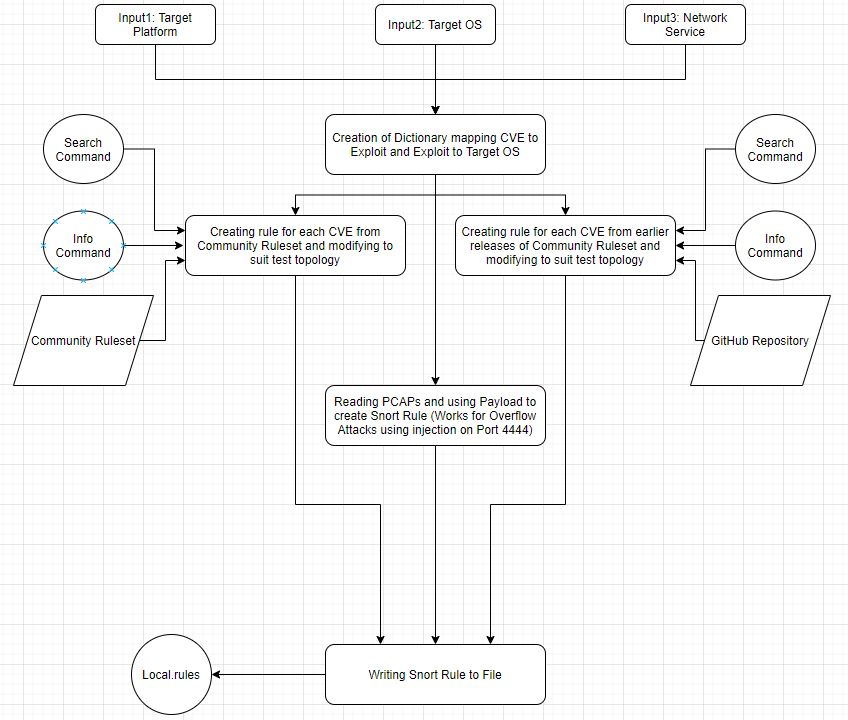
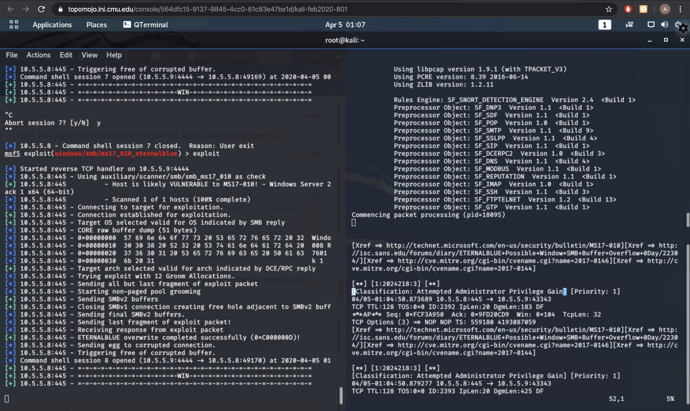
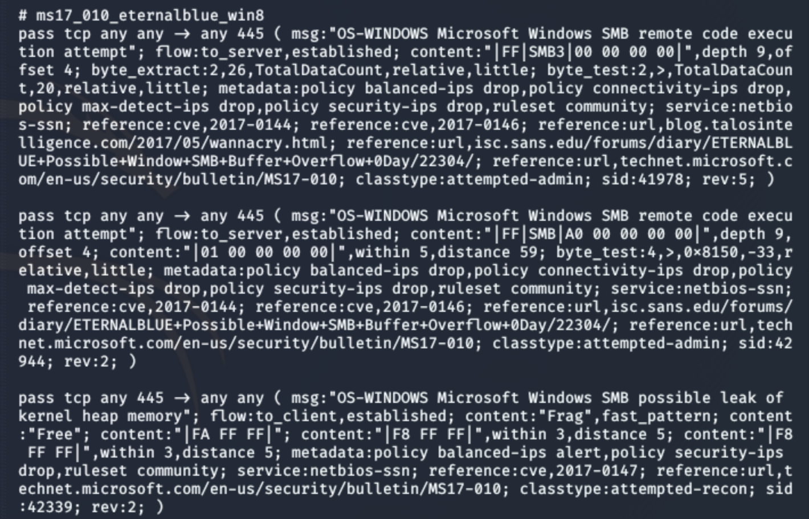

# Automatic-Rule-Generation-Metasploit
GitHub repository for the Automatic Generation of Snort Rules based on Metasploit Vulnerabiities

Every new device added to a network brings with it a new set of vulnerabilities that pose a threat to the entire system.To keep a track of what is added to the network, figuring out the threats introduced and implementing corresponding defenses is tedious as well as an error prone process.Given that vulnerabilities of network devices are known, we plan to use this information to identify dangerous packets and report them. This entire project involves building an algorithm that would first identify threats/attack modules for any device OS that is being added to the network, correlate these threats/attack modules to their respective CVEs and finally either use the Snort community rule files to look for pre-exisiting rules, or craft the Snort rule based on the payload, which will alert the network to malicious traffic. This ensures that the network has dynamic defense setup and is updated against known threats.

Design and Implementation
=========================

**Design**
We intend to show how we can alert our network against known attacks on devices, without manual intervention. For this purpose, our design includes victim machines, which represent various new and un-patched devices that are added into the network. Snort IDS is used to detect and report an ongoing attack. Our Algorithm looks to leverage the Community Rules of Snort, by first looking at automatically determining the Vulnerabilities of the OS of the device on Metasploit and using the CVEs of those known vulnerabilities to filter and add corresponding Snort Rule to flag any potential malicious traffic. In order to increase the percentage of Modules having a direct Snort Rule correlation, we have also considered reading all previous versions of the Community Rulesets if the rule is absent in the latest version of the community ruleset. We have also looked to extend the algorithm to solve injection based overflow attacks due to a common signature being found across those attacks that we exploited.
**Infrastructure and Testbed Setup**
Our testbed has two major types of nodes - attacker and the victims. Each of these VMs are on TopoMojo environment as shown in Figure 1.

Attacker: The first node in our system is the Attacker VM. This is a Kali Linux with Metasploit installed. We use this to scan the victim for exposed vulnerabilities and carry out the actual attack.

Victim: The second type of node in our system are the victim nodes.For our testing we have Windows Server 2008 R2, Windows 2012 R2 and Windows 2016 R2. We started out with this as, these machines have many vulnerabilities.

Snort: Last component of our setup is Snort. Snort is an open source network intrusion detection and prevention tool. This is placed between the attacker and the victim. We use Snort as a packet sniffer that monitors network traffic coming to the victim, in real time and scrutinizes packets to detect various threat signatures. Our algorithm to generate the Snort Rules for different vulnerabilities based on OS will be run here.

Due to testbed limitations, we don’t have an independent Snort VM between Kali and Windows. It is included as part of the Linux machine, which is the Attacker VM.
Snort can be configured to block the attack. However, for the purpose of our project, we have used Snort to passively detect and report an attack.
**Implementation**
Figure 2 explains the algorithm used to report an attack on our dynamic network. As and when a new machine is added to the network, the OS version is detected and taken as input in the snort algorithm. Based on the OS, we find the list vulnerabilities applicable to that version. Eventually we apply the set of corresponding snort rules, to detect and report known attacks that can be carried out on this OS version. Our assumption is that the attacker would use tools like Metasploit to find vulnerabilities in the device and these are the vulnerabilities that we need to protect our setup against.

 [fig:algorithm]

Figure [fig:algorithm] explains the algorithm used to report an attack on our dynamic network. As a new machine is added, the OS version is detected and taken as input in the snort algorithm. Based on the OS, we find its vulnerabilities and a set of corresponding snort rules are applied, to detect and report known attacks that can be carried out on this OS.

Input: When a new system gets added in the our setup, we periodically poll the network to detect the type and OS version of the newly added node. We take this as an input file in our algorithm.
Finding CVEs: From the OS version obtained above, we query Metasploit database to get all or top few vulnerabilities(CVEs) available for that OS version using Metasploit search and info commands in our code.
Finding Snort Ruleset: We query the Snort community ruleset for the CVE. If found, we append the snort rules in a dictionary, corresponding to it’s vulnerable OS.

Finding Snort rules in Git Repositories: Snort community rules is not exhaustive. Preliminary results using Community Rulesets gave an accuracy of 15% in finding a direct mapping of a CVE to it’s snort rules. Using unofficial Github Repository which contains old community ruleset increased CVE coverage immensely and also allowed to extend our code’s knowledge base easily. Our assumption here is that the Git repository itself is reliable even though it is not official.
OS to Snort rule mapping: Finally, map the OS version to the corresponding snort rules. Store in file: After the vulnerability dictionary is created, we write these rules in local\_test.rules files. Rules in this file are used by the IDS to detect the attack.

 [fig:implementation]

Figure [fig:implementation] explains how the code works in our implementation. Details on each activity in the code flow is given below:

**Writing Snort rule to file**:

-   We created a Vulnerability Dictionary we created a mapping of a list of vulnerabilities for a target operating system

-   For each module in the Vulnerability Dictionary for the OS, we write the rules on to the “local.rules” file which will be used by Snort for detection of malicious traffic.The code snippet is as shown in Appendix [appendix:write<sub>t</sub>o<sub>s</sub>nort].

-   We search the rules for each CVE in the Vulnerability dictionary for the OS, and return the rule list for Target OS.The code snippet is as shown in Appendix [appendix:vulnerability<sub>m</sub>apper].

-   For each CVE given to the function, we first iterate through the rule set and see if there is a rule for the CVE in the keys. If there is one, we append this to a list which we will then return.The code snippet is as shown in Appendix [appendix:snort<sub>g</sub>en].

**Technical Challenges**

-   Infrastructure
    Infrastructure was a challenge.During our initial phase of the project, we decided to deploy use Amazon AWS, but unfortunately it doesn’t support vulnerable software versions. Eventually we decided to make a setup of test-bed using our local machines but that wasn’t feasible either due to resource crunch.

-   Attack surface Coverage
    Snort community does not have an exhaustive list of CVEs and their snort rules. Including earlier releases of the community rulesets (git repository) increased the rule coverage however, this does not cover all possible vulnerabilities.

-   Extra rules even if system is actually not vulnerable
    Our algorithm puts in snort rules for all vulnerabilities that are possible in the OS. It is possible that the vulnerability is introduced only when a particular software is installed on the OS however, snort rules for this vulnerability will be be included.

-   Metasploit CVE Coverage
    Some of the Metasploit modules are not linked to any CVEs . Hence, it is impossible to find rules in either the earlier releases of the community ruleset (git repository) or in the current release of the community ruleset.

-   Innocous Traffic Segregation in PCAPs
    Currently we are only able to isolate any injection attacks by the Metasploit Modules and help craft Snort Rules to alert against those attacks.

Evaluation
==========

**Evaluation Setup**
The figure [fig:setup] depicts our testbed setup. We have a single attacker VM and multiple vulnerable VMs in our setup. The attacker VM has network connectivity to the victim machines. Snort is in the middle of the attacker and victims, monitoring egress traffic from attacker VM. Snort variables “HOMENET” and “EXTERNALNET” are modified to suit the current test topology.

We have deployed multiple victim OS such as Windows Server 2008, 2012 and 2016 R2 versions. We have explored vulnerabilities on common network protocols like SMB, UDP and HTTP. We tested them on some of most recent and in-famous vulnerabilities like “Eternal-Blue”.

Our metrics of interest are to ensure a that when a known attack occurs, it gets detected successfully. Secondly, we expect a good snort rule coverage for known OS vulnerabilities. For this, we look for snort rules corresponding to CVEs in the “Community Rule-set” and Git repositories of earlier releases of the rule sets. We anticipate to analyze the packet captures and design the SNORT rules based on attack packet payload if snort rules are not found with previous approaches.
**Methodology**
The Snort website has list of community rule-sets which was initially used to construct OS to rules dictionary. The community rule-set is a collection of frequently used Snort rules for different CVEs. Preliminary results in this stage with this rule-set gave us an accuracy of 15% i.e. 15% of the exploits had a direct mapping of a CVE listed in the references of the snort rule. Further including earlier versions of the rulesets available in github repositories, we were able to achieve an increased hit percentage of 70%.

For the purpose of testing our system, we use Metasploit to conduct the attack. Here we are assuming that the attacker is aware of the operating system of the victim machine. This can be found by running port scans by tools like nmap etc.

Using Metasploit, we as an attacker choose the SMB protocol and choose to target Windows 2008 R2 Server machine. The EternalBlue attack is simulated in the following way-

-   Set the exploit as “windows/smb/ms17/eternalblue”

-   Set the payload to be meterpreter reverse TCP session

-   Set the required options by configuring LHOST(local host) as attacking machine and RHOST(victim machine or remote host)

-   Finally execute the attack using “exploit” command

As shown in Figure 4 we have 2 terminals open. One is the attacking terminal and the other terminal depicts the output of the attack. As we execute the above mentioned steps, we observe that the Snort was able to detect and report the attack successfully.

 [fig:attack<sub>r</sub>esult]

**How the algorithm works against the attack **:

-   Code gets OS version Windows 2008 R2 as input.

-   The code first discovers all the good, average and excellent metasploit modules for a target OS and platform using *“search”*command :

    *msfconsole -q -x search type:exploit platform:Windows target:Windows 2008 R2 rank:excellent rank:good rank:average.*

    *“info”* command is to identify the potential CVEs linked to each module.

-   Corresponding snort rules are found in Snort community and added in local.rules file.

     [fig:snort<sub>r</sub>ules]

**Helper function to calculate coverage percentage of Ruleset**:

-   The coverage of Snort rules is a ratio of number of exploits having corresponding Snort rules (either the Snort community rules or the git repositories) to the total number of known exploits for the victim OS.The code snippet for this is given in [appendix:coverage<sub>c</sub>ount].

The Table [Mapping Results] in Appendix shows the number of exploits that we successfully mapped Snort Rules for and the number of Overflow attacks that we crafted the Snort Rule for after observing the behaviour of the Metasploit Modules from PCAPs.

The table  [Validation Results] gives us the estimate of the number of rules that have been tested to verify if they flag off vulnerable traffic or not.

Conclusions and Limitations
===========================

By integrating Metasploit and Snort with our script we are able to capture the vulnerabilities in a device newly added into the network and also detect if an attack happens on the network devices.

As of now, the algorithm depends on snort community rule set and git repositories to find snort rules for CVEs in Metasploit. While these tools have 60-70% coverage on finding a rule set for the vulnerability , we are aware that not all CVEs are in snort community base. Having the ability to add git repositories allows us to easily increase our knowledge base of snort rules with a caveat of having to trust the git repositories to be reliable. In future we can look at PCAP of incoming traffic to identify an attack. For example, currently a code injection attack based on Buffer Overflow could be carried on port 4444 and traffic to this port can be flagged. We anticipate to achieve greater coverage with this approach.

Acknowledgements
================

This project is being advised by Matthew McCormack, a PhD student working with Professor Vyas Sekar as part of a bigger problem titled “Automatically adding network defenses”.

Writing Snort rule to file
==========================

``` {.python language="Python"}
def write_to_snort(version, rules):
  f = open("/etc/snort/local_test.rules", "a+")
  for i, CVE_rules in enumerate(rules):
    f.write("# "+vulnerability_dict[version][i]+"\n")
    for rule in CVE_rules:
      f.write(rule + "\n")
    f.write("\n")
  f.close()
```

Linking Action and Target version
=================================

``` {.python language="Python"}
def vulnerability_mapper(action, version):
  res = []
  if version in vulnerability_dict.keys():
    for CVE in vulnerability_dict[version]:
      res.append(snort_gen(action, CVE))
  return res
```

Fetching Snort Rule for each CVE
================================

``` {.python language="Python"}
def snort_gen(action, CVE):
  return_list = []
  if CVE in rule_set.keys():
    for item in rule_set[CVE]:
      return_list.append(action + " " + item)
  return return_list
```

Creation of dictionary mapping CVE to Exploit and exploit to target
===================================================================

``` {.python language="Python"}
def create_vulnerabilty_dict(platform, target, module):
    if platform != ' ':
        if target != ' ':
            if module != ' ':
                child = pexpect.spawn('msfconsole -q -x \"search type:exploit platform:'+platform+ ' target:'+target+' description:'+module+' rank:excellent rank:good rank:average\"')
            else:   
                child = pexpect.spawn('msfconsole -q -x \"search type:exploit platform:'+platform+ ' target:'+target+' rank:excellent rank:good rank:average\"')
        else:
            if module != ' ':
                child = pexpect.spawn('msfconsole -q -x \"search type:exploit platform:'+platform+ ' description:'+module+' rank:excellent rank:good rank:average\"')
            else:   
                child = pexpect.spawn('msfconsole -q -x \"search type:exploit platform:'+platform+ ' rank:excellent rank:good rank:average\"')
    else:
        if target != ' ':
            if module != ' ':
                child = pexpect.spawn('msfconsole -q -x \"search type:exploit target:'+target+' description:'+module+' rank:excellent rank:good rank:average\"')
            else:   
                child = pexpect.spawn('msfconsole -q -x \"search type:exploit target:'+target+' rank:excellent rank:good rank:average\"')
        else:
            if module != ' ':
                print("msfconsole -q -x \"search type:exploit description:"+module+" rank:excellent rank:good rank:average\"")
                child = pexpect.spawn('msfconsole -q -x \"search type:exploit description:'+module+' rank:excellent rank:good rank:average\"')
            else:   
                child = pexpect.spawn('msfconsole -q -x \"search type:exploit rank:excellent rank:good rank:average\"')
    child.expect('msf5')
    cmd_show_data = child.before
    output = cmd_show_data.decode('utf-8').split('\r\n')
    output = output[15:]
    output = list(filter(('').__ne__, output))
    vulnerabilities = []
    for data in output:
        found = re.findall(r'exploit/\w*/\w*/(\w*)',data)
        entire_vuln = re.findall(r'(exploit/\w*/\w*/\w*)',data)
        if found:
            vulnerabilities.append(found[0])
            child.sendline('info '+entire_vuln[0])
            child.expect('msf5')
            reverse_dict[found[0]] = entire_vuln[0]
            cve_number = child.before
            cve_list = []
            for line in cve_number.decode('utf-8').split('\r\n'):
                if re.findall(r'cve/(\w*-\w*-\w*)/', line):
                    cve_list.append(re.findall(r'cve/(\w*-\w*-\w*)/', line)[0])
            cve_dict[found[0]] = cve_list
    child.sendline('exit')
    return vulnerabilities
```

Mapping rule for each CVE from Community ruleset and modifying this mapped rule to suit test topology
=====================================================================================================

``` {.python language="Python"}
def create_rule_set(target):
    print("Creating Rule Sets for the vulnerabilities from the Snort Rule Set")
    fline = open("/root/Downloads/snort3-community-rules/snort3-community.rules", "r").readlines()
    if target in vulnerability_dict.keys():
        for vuln_module in vulnerability_dict[target]:
            if vuln_module in cve_dict.keys():
                if vuln_module not in rule_set.keys():
                    rule_set[vuln_module] = []
                for cve in cve_dict[vuln_module]:
                    for line in fline:
                        if '-'.join(cve.split('-')[1:]) in line or ','+cve.split('-')[2] in line or '/'+cve.split('-')[2] in line:
                            line = line.replace('# ','')
                            if line.split(' ', 1)[1].replace("$HOME_NET", "any").replace("$EXTERNAL_NET", "any") not in rule_set[vuln_module]:
                                rule_set[vuln_module].append(line.split(' ', 1)[1].replace("$HOME_NET", "any").replace("$EXTERNAL_NET", "any"))
#   print(json.dumps(rule_set, indent = 1))
```

Mapping rule for each CVE from earlier releases of the ruleset and modifying this mapped rule to suit test topology
===================================================================================================================

``` {.python language="Python"}
def create_rule_set_github_repo(target):
    print("Creating Rule Sets for the vulnerabilities from the Custom Github Repositories")
    for filename in only_files:
#       print("Going through : "+filename)
        fline = open("/root/Downloads/snort-rules/snortrules-snapshot-3000/rules/"+filename, "r").readlines()
        if target in vulnerability_dict.keys():
            for vuln_module in vulnerability_dict[target]:
                if rule_set[vuln_module] == []:
                    for cve in cve_dict[vuln_module]:
                        for line in fline:
                            if '-'.join(cve.split('-')[1:]) in line or ','+cve.split('-')[2] in line or '/'+cve.split('-')[2] in line:
                                line = line.replace('# ','')
                                if line.split(' ', 1)[1].replace("$HOME_NET", "any").replace("$EXTERNAL_NET", "any") not in rule_set[vuln_module]:
                                    rule_set[vuln_module].append(line.split(' ', 1)[1].replace("$HOME_NET", "any").replace("$EXTERNAL_NET", "any"))
```

Helper function to calculate coverage percentage of Ruleset
===========================================================

``` {.python language="Python"}
def coverage_count(dictionary):
    empty = total = 0
    for item in dictionary.keys():
        if dictionary[item] == []:
            empty += 1
            empty_list.append(reverse_dict[item])
        total += 1
    empty_percent = (empty / total) * 100
    print("Total number of exploits in the search command", total)
    print("Total number of exploits which have a Snort Rule in the Community Ruleset", (total - empty))
    print("Total number of exploits which do not have a Snort Rule in the Community Ruleset", (empty))
    return empty_percent
```

